<h1 align="center">qase-tunnel</h1>

<p align="center">
  <i>Securely expose private internal sites to Qase Cloud for AI test generation, reachability checks, and browser-driven test runs.</i>
</p>

<p align="center">
  <a href="https://github.com/qase-tms/qase-tunnel/releases/latest"></a>
  <a href="https://github.com/qase-tms/qase-tunnel/actions/workflows/release.yml"></a>
  <a href="https://goreportcard.com/report/github.com/qase-tms/qase-tunnel"></a>
  
</p>

---

## What it does

Need Qase to reach `https://internal.your-company.test` — for AI test generation, environment reachability checks, or browser-driven runs against an environment that's only reachable from inside your network?

`qase-tunnel` runs on a machine inside your network, authenticates against your Qase workspace, and opens an encrypted outbound channel so Qase Cloud can reach your private hosts **through your tunnel only** — no inbound firewall rules, no DNS exceptions, no port-forwards.

Every request is gated by your Qase API token plus a per-tenant secret; nothing else — inside or outside Qase Cloud — can use your tunnel.

## Install

### macOS / Linux

```bash
brew install --cask qase-tms/tap/qase-tunnel
```

> First time? `brew tap qase-tms/tap` then `brew install --cask qase-tunnel`.

### Windows

```powershell
Invoke-WebRequest -Uri "https://raw.githubusercontent.com/qase-tms/qase-tunnel/main/script/install.ps1" -OutFile "install.ps1"
.\install.ps1
```

The script auto-detects `amd64` vs `arm64`, downloads the latest signed binary, verifies its SHA256, installs to `%LOCALAPPDATA%\qase-tunnel`, and adds it to your user `PATH`.

### Universal fallback (curl)

```bash
curl -fsSL https://raw.githubusercontent.com/qase-tms/qase-tunnel/main/script/install.sh | bash
```

### Manual

Download the archive matching your OS + arch from the [latest release](https://github.com/qase-tms/qase-tunnel/releases/latest), verify it against `checksums.txt`, extract, and drop `qase-tunnel` into a directory on your `PATH`.

## Quick start

```bash
# 1. Register the tunnel against your Qase workspace
qase-tunnel start -a <YOUR_QASE_API_TOKEN>

# 2. Verify the tunnel is registered
qase-tunnel status

# 3. Leave it running — the cloud will route to your private hosts now
```

After the first `start`, your credentials are stored locally in `~/.qase-tunnel/` (mode `0700`, two encrypted files inside). Subsequent runs are `qase-tunnel` with no flags — it resumes the saved tunnel.

## How it works

<p align="center">
  
</p>

<!-- Diagram source lives at docs/architecture.mmd. Regenerate with:
     npx --yes -p @mermaid-js/mermaid-cli mmdc \
       -i docs/architecture.mmd -o docs/architecture.svg --backgroundColor transparent
-->

Two zones, one outbound connection:

- **Qase Cloud** (blue) runs your workspace and the cloud-side workers that drive your tests
- **Your network** (orange) is where you install `qase-tunnel` — it dials Qase Cloud and stays connected
- Cloud workers talk to your private hosts **through** that single outbound channel; the channel is encrypted with a per-tenant secret so no other tenant can ride it

## Commands

| Command | What it does |
|---|---|
| `qase-tunnel start -a <token>` | Register a new tunnel and start serving requests. |
| `qase-tunnel` | Resume the saved tunnel (run as your default daemon). |
| `qase-tunnel status` | Print the saved tunnel configuration (no secrets). |
| `qase-tunnel reset` | Forget all saved credentials. Next run starts the wizard. |
| `qase-tunnel diagnose` | Run pre-flight connectivity checks. |
| `qase-tunnel --debug` | Add verbose per-request logs (filtered to ~1 line per request). |
| `qase-tunnel --help` | Full flag reference. |

## Files

Credentials live in `~/.qase-tunnel/`:

- `key.bin` — the local encryption key (mode `0600`)
- `secrets.enc` — your API token, tunnel UUID, agent name, and tunnel secret, encrypted with `key.bin` (mode `0600`)

Both are created on first `qase-tunnel start` and removed by `qase-tunnel reset`. The directory itself is `0700` — readable only by your user. Back this directory up if you want to move your tunnel to another machine without re-registering.

## Troubleshooting

**"invalid user token"** — almost always a stale token after a password rotation or token revocation. `qase-tunnel reset && qase-tunnel start -a <NEW_TOKEN>`.

**Frequent reconnects in logs** — a corporate proxy or firewall is closing long-lived TCP. Set `HTTPS_PROXY` so the tunnel routes through your proxy, or open outbound egress to the host shown in `qase-tunnel status`.

**Want to see what requests the cloud is making through your tunnel?** Run with `--debug` for one line per request.

**Still stuck?** Run `qase-tunnel diagnose` and attach the resulting log to a support ticket.

## Security

- **Per-tenant isolation.** Every tunnel has its own secret. No other customer — and nothing else inside Qase Cloud — can route traffic through your tunnel.
- **Outbound-only.** `qase-tunnel` dials Qase Cloud; Qase never initiates a connection into your network. No inbound firewall rule is required.
- **You hold the off-switch.** Stop the binary and Qase loses access to your private hosts immediately.

## License

[MIT](./LICENSE) © Qase
